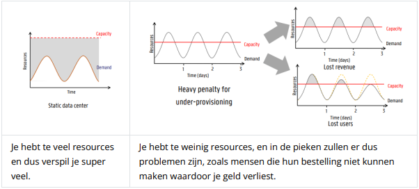
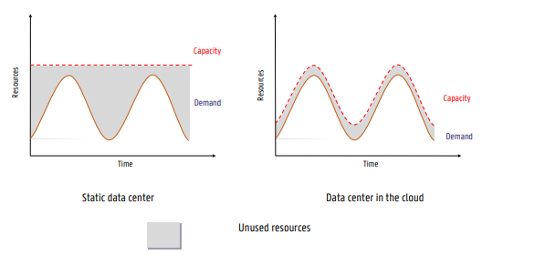
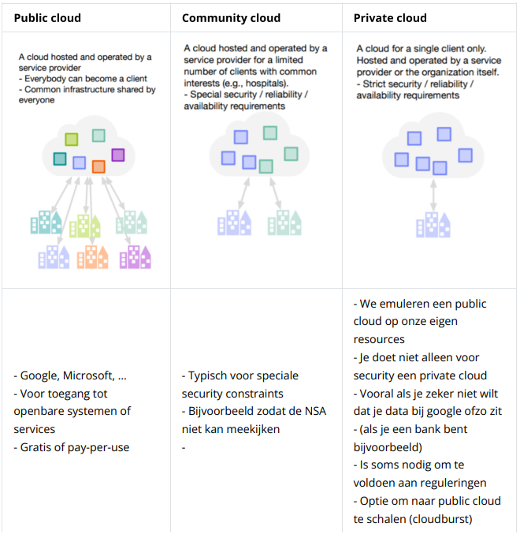
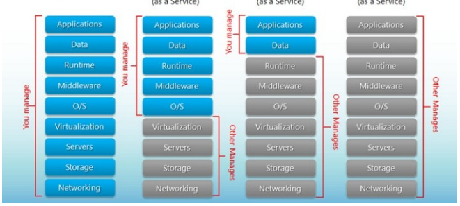
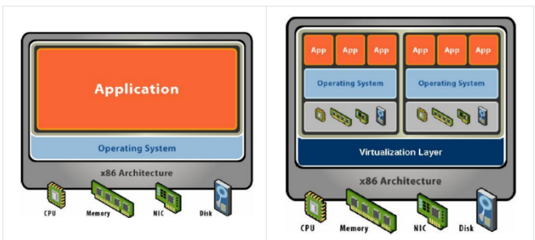
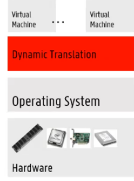
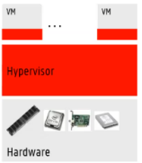
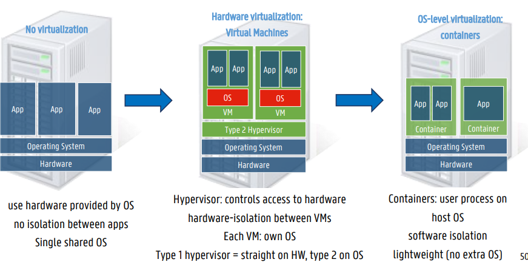
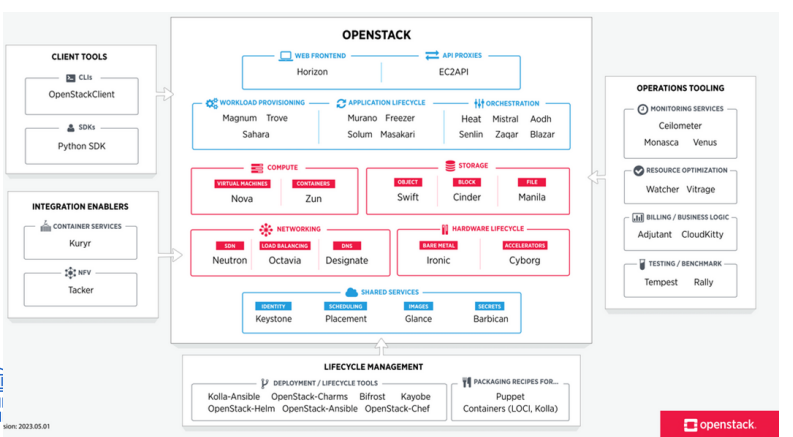
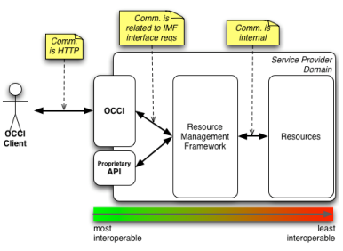

# System Administration

## Chapter 1: Cloud

---

> Definition of **Cloud**

Clouds are a large pool of easily usable and accessible **virtualized** resources (such as **hardware**, **development platforms** and/or **services**). These resources can be dynamically reconfigured to adjust to a variable load (scale), allowing also for an optimum resource utilization. This pool of resources is typically exploited by **pay-per-use** model in which guarantees are offered by the infrastructure Provider by means of customized **SLA's** (Service Level Agreements)

### Economics of Cloud Users

Having machines yourself, can cause problems:

The **under/over provisioning issue** can be solved using the **pay-per-use** mechanism. This way, you don't pay for the surplus of resources in lower traffic moments, thus you can scale dynamically based on the traffic you have.

**Note**

Because of **economics of scaling** cloud providers can sell there services for cheap compared to you having your own machines. This is because they usually have deals with electricity companies etc. They also place their datacenters in optimal locations for the resource providers (ISP, electricity, ...)

### What does cloud computing do?

- Provide online data storage/retrieval
- Enables acccess to online applications
- Provides computing platform and computing infrastructure

### Off premise cloud characteristics

**=** Making your own cloud in your company is called an **on-premise cloud**. It is **off-premise cloud** when this is not the case.

- **off-premise cloud**

  - hosted in other location
  - over public cloud
  - processing is outside of the firewall

- **elasticity**

  - scalability of provider
  - fast scaling/descaling

- **flexible billing**
  - payment is based on sub or based on usage
  - cost effective
- **virtualization**

  - cost optimized becuase of **multi-tenant** systems (multiple clients on 1 machine)

- **On demand self-service**
  - when needed request service, service is provisioned through self-service portal (bol.com bv)

### Cloud deployment models

### Hybrid Cloud

**=** Combining private cloud + public cloud
The critical activaties are in the private cloud and the non-critical activaties are in the public cloud. You can also do **cloud bursting** = ask extra resources from public cloud if needed, when not needed, give these resources back. **Multicloud** is the concept where companies use different cloud providers.

### Cloud Models

### Infrastructure-as-a-service (IAAS)

IAAS provides physical and virtual computation/storage/network resources.

There are different **offerings**:

- Closed IAAS
  - AMAZON, GOOGLE, ...
- Container as a service offerings
- Open IAAS
  - OpenStack

**multi-tenacy**: Physical computer gets divided into multiple users. How is this possible?

- Through abstraction:
  - Make a an abstract model of how a generic resource looks
  - sometimes causes lower performance
- Through virtualization:
  - No dependencies on physical machines

### Virtualization

For virtual machines in the cloud is generic hardware used. Virtualization is build on top and virtualized hardware is simulated. Here are some **advantages** to this:

- **VM isolation**

  - Secure multiplexing

    - Safely place multiple users/applications on the same hardware without them being able to interfere with each other
    - Modern processors have better support for virtualization, e.g., direct memory access

  - Strong guarantees

    - Bugs, crashes, viruses in one VM do not affect other VMs (unless there are bugs in the VM software itself)

  - Performance isolation
    - Partitioning system resources. For example, you cannot exceed the limit of the VM, even if the physical machine has more memory

- **Mixed OS envs**

  - Multiple Operating Systems on 1 machine

- **VM encapsulation**
  - We can stop a VM and put it in a file to, for example, forward it, with the complete state of memory, applications, and data.
  - Then we can easily start up the VM somewhere else.
- **VM Compatibility**
  - Old legacy applications can be run on VMs
  - Hardware-independent
  - Create once, run everywhere

### Virtual Machine Use Cases

- Running legacy applications
- Software testing, with a 'clean' install of OS and software
  - This also allows for quick testing on different operating systems
- Malware testing
  - Load into a controlled system
- Test and development
  - Quick testing, development and spinning up operational servers
- Business continuity
  - Quick deployment on multiple servers
- Enterprise desktop
  - Securing unmanaged PCs without sacrificing end-user autonomy by implementing a security policy around desktop virtual machines
- Server consolidation
  - Reduce costs by running services on as few machines as possible
  - Therefore, doing multiple things on one machine (consolidation)

### Evolution

**first generation**

- Full virtualization, the software emulates a complete physical hardware system
- Completely software-based, you do not need to modify the guest operating system
- The hardware had no notion of virtualization
- The abstract model of the virtual machines was translated to the hardware (binary rewriting)
- The biggest disadvantage is performance (25-75% slower memory access, etc.)

**second generation**

- Paravirtualization
  - In the VM (guest operating system), make a number of adjustments so that we can still communicate directly with the hardware.
  - The disadvantage is that the guest OS must be modified depending on the used hypervisor (does not talk to VMs directly).
    - For example, installing VMwareTools so that the VM has less delay for mouse input.
  - The advantage is that it is faster than the previous generation.

**third generation**

- Hardware-assisted virtualization: hardware is aware that virtualization exists
  - Guest OS does not need to be modified
  - You still need two things:
    - A hypervisor that supports hardware acceleration
    - Processors that support hardware acceleration
- The hypervisor has direct access to RAM, network, storage, etc.
- The advantage is that you can run an unmodified OS with high performance, but it must be software that supports this.
- The disadvantage is the startup time of the VM, as it does not boot up as fast as a PC. This problem is common to all VMs.
  - With a container, you do not have this problem according to Bruno.
  - For a site like Zalando, this delay is not an issue, but for Ticketmaster, where suddenly thousands of people may refresh at the same time, it is a problem.

### OS-level virtualization

- There is also a different approach to virtualization: OS-level virtualization is done at the operating system level. This is often used for containers. The main advantage of this is density because containers do not carry all the extra baggage that comes with VMs (such as OS and bios). They take up much less space.

- If you use containers, you can host many more servers on the same hardware than when using VMs. Containers are mainly used in the hosting market according to Bruno.

### Deploying Workloads: From no virtualization to containers

### Container

- Containers share the same OS/kernel and can communicate with the host via standard system calls. Moreover, each container is logically independent of the others and does not need to carry a large amount of data (applications/data). A container can also be paused and moved to another machine very quickly.

The advantages of containers include:

- Faster start-up time
- Density
  - You can run many more containers on a single physical host compared to VMs, since containers only need a fraction of the physical resources.
- Potential better management
  - Because the shared kernel has a better overview of the resource usage of all containers.
- Using hypervisors, you need to employ all sorts of tricks to manage them properly.
- More containers = more profit

> ### Hypervisor based vs containers comparison table
>
> | Hypervisor                                                     | Container                                                                                                                               |
> | -------------------------------------------------------------- | --------------------------------------------------------------------------------------------------------------------------------------- |
> | One real hardware, many virtual hardwares, many OSs            | One real hardware, no virtual hardware, one kernel, many user space application instances. Hardware acceleration is thus more difficult |
> | High versatility, can run different OSs                        | Here, for example, you cannot run a DOS application                                                                                     |
> | Lower density                                                  | Higher density                                                                                                                          |
> | Virtualization/emulation overhead (third generation much less) | Near-native performance, almost no overhead                                                                                             |
> | Hardware-enforced isolation                                    | Software-enforced isolation (less secure)                                                                                               |
> | Size: potentially large (OS in VM)                             | Size: potentially small                                                                                                                 |
> | Boot time: relatively high                                     | Boot time: fast                                                                                                                         |

### Open IAAS Offerings

#### Openstack

**Openstack** is a software platform that allows you to setup your own IAAS platform, even on hardware that you lend from large providers. Typical on your own cloud.

- Most used IAAS open source framework.
- Can be complex

#### Apache cloudstack

- second most used after openstack
- easier to install compared to openstack
- API compatibility with AWS for hybrid cloud

#### OpenNebula

- way less expanded than openstack
- used by really large companies
- dont choose this
- less drive than others

#### Eucalyptus

not used

...

### IAAS cloud standardisation

- **open virtualization format (OVF)**

  - describes a way to put virtual machines in a file
    - contains OVF descriptor: XML die de ingepakte VM beschrijft
    - Disk images
    - Certificates and licenses
  - You can just relocate your VM

- **Open cloud computing interface (OCCI)**

    - Avoids the use of proprietary IAAS APIs
    - Commands to start and stop VMs are uniform across different systems.
    - Uses a RESTful protocol for deployment, automatic scaling, monitoring, network, and storage resources.
    - Supported by OpenStack, OpenNebula, Cloudstack, Amazon AWS.
    - Not supported by Azure and Google Cloud, which likely means the standard has become obsolete. The last version was in 2015.

- **Cloud Infrastructure Management Interface (CIMI)**

  - Not the same as OCCI.
  - The latest version was in 2016.
  - Only implemented for Openstack, which limits its usefulness.

- **Cloud Data Management Interface (CDMI)**

  - Primarily designed to connect storage to running VMs.
  - A RESTful standard for storage, exporting users, data transfer between cloud systems, etc.
  - The latest version was in 2014.

Both OCCI and CIMI are infrequently used; the de facto standard is now Amazon EC2 (Elastic Cloud). It is not an official standard, but widely adopted. EC2 provides a REST API and numerous SDKs for various programming languages.

Azure and Google Cloud offer similar services.

### Mulicloud Development

A multi-cloud development library voorziet een API die abstractie maakt van de verschillen tussen verschillende cloud providers:

- Apache libcloud
- apache jclouds
- ...

### Open Container Initiative (OCI)

OCI has the same goal as the standards discussed above but focuses on containers. There are two main ways this is achieved:

- Runtime specification (runtime-spec)
  - An API that standardizes how containers are started, stopped, paused, etc.
- Image specification (image-spec)
  - Similar to OVF, but for container images
  - Describes how to package a container into a file

### Container Networking Interface (CNI)

CNI provides an interface between the container runtime and network implementation. CNI supports third-party plugins for more complex solutions. It is a standard that describes how containers get IP addresses, how they are accessible, how they do routing, etc. CNI is used by Kubernetes among others.

### Platform as a service (PAAS)

At PAAS, you don't have to worry about the runtime, middleware, and OS like with VMs. You only need to focus on the application and its data. It's primarily web-based applications that allow you to quickly build an application. Typically, you get some sort of drag-and-drop interface to glue applications together.

-> example is **redhat openshift**

### Kubernetes vs openshift

| Parameter                 | Kubernetes                                                                                     | Openshift                                                                                     |
| ------------------------- | ---------------------------------------------------------------------------------------------- | --------------------------------------------------------------------------------------------- |
| Origin                    | Open-source project/framework, not a product                                                   | Product with many variations. OpenShift Origin is open source, but it's not the best version. |
| Installation              | Can be installed on almost any Linux distro                                                    | Limited, mainly Red Hat Enterprise Linux (RHEL)                                               |
| Key Cloud Platforms       | GKE on Google Cloud, EKS on Amazon AWS, and AKS on Microsoft Azure.                            | Red Hat supports AWS and Azure                                                                |
| Security & Authentication | Well-defined, but not as strict as OpenShift. You need to do a lot yourself to make it secure. | Stricter security policies and authentication models                                          |
| Use of templates          | Kubernetes Helm templates are flexible and easy to use                                         | OpenShift templates are less user-friendly and flexible                                       |
| Releases                  | 4/year                                                                                         | 3/year                                                                                        |
| CI/CD                     | Possible with Jenkins but not integrated into Kubernetes                                       | Integrated with Jenkins                                                                       |
| Learning curve            | No easy-to-use web UI                                                                          | User-friendly web console                                                                     |
| Initial rollout           | Difficult if new components need to be installed (e.g., dashboard)                             | All-in-one solution                                                                           |

### PAAS CLOUD STANDARDIZATION

#### There are also a number of standards for PAAS:

##### Cloud Application Management for Platforms (CAMP)

- Developed by Oasis
- Describes the application artifacts and the services needed to run and connect them
- Same as OCCI for IAAS
- Provides a uniform interface management interface across PAAS providers through REST calls
- In theory, you can run an application on different PAAS platforms, but nobody really uses it

##### Topology and Orchestration Specification for Cloud Applications (TOSCA)

- Very extensive standard
- Creating a blueprint
  - Orchestration of cloud services
  - Their relationships
  - How they are managed

The problem is the standard is not "hot". The cloud vendor can decide for themselves.

- Implementations
  - Tosca-parser for OpenStack
  - OpenTosca
  - Cloudify

However, there is no significant industrial uptake

- Suddenly, Red Hat has dropped the Tosca v2 track
- It is still under development

##### Cloudify

- Uses Tosca
- You can turn many loose Tosca blueprints
  - The idea is that in theory, you could move your blueprint to another cloud provider and continue running your application there
- Focus on network function virtualization (NFV) domain.
- High-profile clients like AT&T, KPN, ...

### Software-as-a-service (SAAS)

These are applications such as Office 365, Dropbox, Google Apps, ... Here there are not really standards to determine them except for lock-in. There are a few things you should consider:

- Using APIs, protocols, and data formats that are well defined
  - Where possible, work with standard APIs, protocols, and data formats
    - Possibly a large user base like Google's infrastructure
  - Is it an open version or proprietary or on-premise version?
    - Can you easily switch from one?
- What happens to your data if the service is no longer available?
  - You should consider whether you can lay claim to your data
    - For example, is there an open standard
    - Or if the data can be removed from you

## Function-as-a-service (FAAS)

FAAS is actually an extension to serverless computing. You can run your code without having to worry about managing the servers.

- Serverless computing
  - Typically, code fragments that run without the servers needing to manage them. Data is also only over the resources that are used.
  - The cloud provider dynamically manages the allocation of resources
    - Advantages
      - AWS Lambda
      - Azure functions
      - Google cloud functions
      - Cloud foundry application runtime
    - Disadvantages
      - Vendor lock-in
        - Forced API upgrades
        - Increased costs
        - Variable limits
- No FAAS standards and vendor lock-in are imminent
  - Little tools for debugging and monitoring
    - Depends on the vendor
  - Architectural complexity
    - Difficult to decide which servers are the most important
      - How much one function does
      - You can also lock in to the services. Kubernetes has some extensions why you do serverless computing

## Metal-as-a-service (MAAS)

- Software layer that ensures that you can use the machines in use as needed.
  - They typically offer more performance overhead than VMs.
- MAAS aims to provide the service via the machine and to offer a platform for management, installation, ...
  - It is mainly about performance gains
