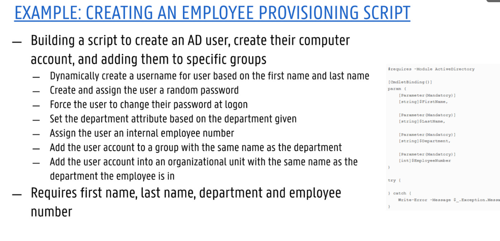

## Chapter II: Powershell

**Powershell** is a universal automation, scripting and development tool and is developped to automate tasks without programming knowledge

Some interesting commands:

- **Get-Alias**: shows list of aliases (zal een onderliggende commando representeren), de volledige list krijg je enkel op Windows
- **Get-Command**: shows list of commands
  - Different flavours:
    - most are **cmdlets**, often written in C#
    - **Functions** are commands written in Powershell
- **Get-Help**: Same as **man** in Linux
- **Update-Help**: update its help information

These commands also have parameters. These values will change the behaviour of the command. Powershell does not have **sudo**, so it can be annoying sometimes to use.

### Basic Concepts

#### Variables

**$var**

The strict mode will prevent you from using the var without defining it first (**Set-StrictMode -Version Latest**)

#### Automatic Variables

has premade variables. You can change these, but maybe dont :)

**$null** -> represents nothing, but you initialise it. This is used a lot to give a var a value as response of output of a certain function

**$LASTEXITCODE** -> returns code of last external executable program, 0 = success, anything else does is not a success.

#### Data Types

basically same as things we know: strings, int32 (standard), int64, bools, float (32 bits), double (64 bits)...

'' -> no variable expansion
"" -> variable expansion
\_ -> powershell will treat this as a commando

#### Objects

In powershell, everything is an object

- $color, is a string object

Every object has properties -> object -Property

The **Get-Member** method will show you all the functions for an object

#### Utilizing methods (not important)

#### Array Data Structure

$color_picker = @('blue', 'yellow')

Using **+** will make a new array
Using **+=** will append item to array

ArrayLists are dynamic (vectors) and are better for when you have arrays with heavy objects. Cast your array to an arraylist :)

In an arrayList, + and += do not exist, use **Add()**, **Remove()**

#### HashTable Datastructure

$users = @{
Niels = ...
}

**manipulation** -> Add(), ContainsKey(), Remove()

#### Creating Custom Objects

Utilize **new-object** cmdlet

This object can then be used like anyother object

#### Using a Pipeline

The output of one command will be piped to another command.

for example: Get-Service | Start-Service

#### Piping arrays between commands

Shows an example

#### Parameter Binding

Passing parameters to a command, PS inits a process knwon as **parameter binding**, in which it matches each object into the command to the various parameters specified by the command's creator.

To see if a pipeline is possible you must use Full parameter on the **Get-Help** command.

#### Writing Scripts

By default you cannot run a script. You then need to customize the **Execution Policies**, just put it on **Unrestricted** -> Allows to run any script.

you also have:

- Restricted: does not allow running scripts
- AllSigned: scripts need to be signed
- RemoteSigned: run scripts you made or script downloaded that where signed by others

#### Script Signing

A script signature is an encrypted string at the end of your script

#### Scripting in Powershell

extension is **.ps1**.

#### Expressions

- eq
- ne
- gt
- ge
- lt
- le
- contains
- not

- Quiet -> gives the essential information of a method

#### IF-statement

if () {}
else if

#### Switch Statement

Hier ga je alle condities controleren (niet als je een **break** gebruikt), bij else if else if else if niet.

#### Loops

- foreach, for, do/while, ...

.... We already know this stuff..

for each is under the hood the best way

for ($i = 0 ; $i lt 10 ; $i ++)

### Error Handling

two types of errors:

- **Terminating error**: any error that stopt execution of the code

- **Non-terminating error**: error that is not servere enough to halt the rest of the code

Decision is made by the developer!

#### Handling non-terminating errors

some information...

#### Handling terminating errors

try catch block

catch does not catch non-terminating errors

each error is stored in a PS automatic variable $Error

#### Writing Functions

Code can be broken down into functions

- Similar to cmdlets such as **Start-Service** and **Write-Host**

function <name> {code_block}

use the **Noun-Verb** name

#### Adding parameters

#### Mandatory Parameter Attribute

This can force you to use the parameter

default parameters and parameter validation also exist

**ValidateSet** can be used to validate the parameters, @{'1', '2'} -> Only Version 1 and 2 are applicable

#### Accepting Pipeline Input

- ByValue (entire object)
- ByPropertyName (single object property)

You need to however add a **process block**, because otherwise it will only do it on the last iteration

### Modules

**Importing**

...

- .psm1 file extensionm can be a PS module

- Module manifest '.psd1' file

There is a Powershell Gallery to view all modules

### Running Scripts Remotely

This can be done using PSSessions

#### Working with scriptblocks

essentially lamda functions

when we define a var to a codeblock, we need to add & before the var to execute the codeblock

**Invoke-Command**:

two way to use it:

- first is when running ad hoc commands
- second is using interactive sessions

You can also use Invoke-Command to execute entire scripts

best way is to use **$using** before any local variable name

#### Creating new session

...

#### Invoking Commands in a Session

#### Opening Interactive Session

use Enter-PSSession

Powershell is really good to parse **CSV files**

#### Using Import-CSV to process data

Essentially, this import tool is really strong

You can also create CSV files

Same with JSON, **ConvertFrom-JSON**, takes raw JSON and converts it to a PS object.

You can also just create JSON

#### Querying and parsing a Rest API (Important for labs)

This is also truly possible, wow! :sunglasses:

#### Manipulating Active Directory

This is just a keyvalue store (manage printers, servers, ...)

ActiveDirectory module is required!

#### Search Adaaccount and returning single objects

- Search-ADAccount command:

Sometimes, when you know which AD object your looking for, you don't need a filter

#### Finding User accounts that have not changed password

#### Creating and changing AD objects: Users and computers (Lab II)

...

Each user can be part of a group

#### Assigning random passwords

whatever

### Labs

Labs are mandatory

V, VI, VII are dangerous, because the clusters could get destroyed, make sure to be proactive

