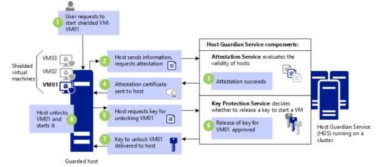
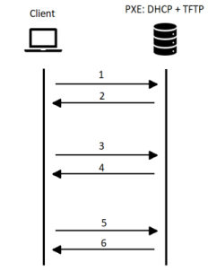

# Chapter 3: Windows Server

three different kinds of servers:

- Rack-mountable server: designed to be installed in a rack
- Blade server: installed in server chassis to save space and power
- Tower servers: single big case servers that stand upright

### Processors

A server has one or more processors:

- speed
- cache
- cores
- word size
- virtualization technology

### Primary Storage: Memory

RAM and ROM memories of a server are **primary storage**. Usually these come with ECC = error-correcting code that make sure faults in the memory are detected and corrected. Some other types of RAM are SDDC, DDDC, ... Server RAM is really expensive and it does not need 8 Gigs, but a lot more...

**secondary storage**, or disks, are typically hot-swappable and allow large amounts of memory for data.

### Network Interface

Servers usually have multiple network interfaces, this causes some advantages:

- NIC teaming: Upgrades BW from and to server
- Network Seperation: Network is more modular

### Windows Server

Windows Server is an OS made by microsoft to manouver servers. There are a couple of different versions:

- Windows server **datacenter**
  - most complete version, used when a lot of virtualization is needed
- Windows server **standard**
  - Standard version
- Windows essentials
  - cheap version, used when only one server
  - kinda the same as the standard version at this point

### Features

- Features for hybrid cloud capabilities
- Features related to security
  - support for shielded VMs
  - new encryption standards
  - Trusted Platform Module 2.0
- Features for infrastructure and performance improvements
  - support for monitoring over the whole cluster and large hardware

### Shielded VMs

A shielded VM ensures that the VM is executed in a secure environment, which assures that no one is watching what you are doing. Starting a shielded VM involves 8 steps:

1. The user requests a shielded VM.
2. The host sends information about itself to the Host Guardian Service (HGS) asking for permission to start the VM.
3. The Attestation Service of the HGS checks whether the information is valid and whether the host is known.
4. If this is okay, the host receives a certificate from the HGS.
5. Now the host asks for a key to unlock the VM, because without unlocking it, it cannot be started. The host therefore sends this request together with its certificate to the HGS.
6. The Key Protection Service of the HGS then decides whether to provide the host with a key.
7. The HGS sends the key to the host.
8. The host can now unlock the VM and start it.

It is now impossible to inspect the data and the state of the trusted VM. This is because a part of the processor, called the Trusted Platform Module (TPM), ensures encryption. The data can only be decrypted with the keys from the HGS. Thus, whatever is executed in a certain process on the VM can only be viewed by the person who executes it.

### System Insights

Using predictive analysis you can get better insights, ...

### Azure

Windows Server now supports Azure Hybrid Cloud, which provides an enhanced connection between on-premises servers and cloud devices on Azure. Additionally, they now offer a storage migration service. This makes it easier to migrate data from old Windows servers, Linux servers, or file shares to Azure or Windows Server.

### Storage Replica

Windows Server also provides volume replication. This can be done in two ways:

- **Synchronous**: When you write something, you only receive an acknowledgment after it has been written to all replicas.
- **Asynchronous**: You receive an acknowledgment when it has been written to the first replica, the rest follow later.

### Microsoft Defender

Defender provides a centralized point for security within your company. It also includes a number of cool features. For example, you can quite easily go back in time to find information about breaches and problems, but also intrusion detection and research into the cause are possible.

### Administration

The thing that most annoys Bruno is that there are typically five different ways to do a task. That's not bad in itself, but the problem is that each tool often covers more than 60% of the tasks.

The tool that is most useful is PowerShell. As a good sysadmin tool, automation can take over many tasks that are often performed manually. Typically, servers in data centers are set to spin without the need to physically interact with them, hopefully, you don't need to each time initiate remote desktop logins. Try to do as much as possible in PowerShell through the remote console.

### Privileged Access Workstation

A Privileged Access Workstation (PAW) is a special computer from which administrative tasks are performed. No one should be able to make any changes to the system from anywhere else.

This computer typically has a locked-down configuration. It's made to ensure that unauthorized and designated software cannot be easily installed. A PAW is usually configured as follows:

- Set up detail-guarded and whitelisted software to be allowed
- Implement Credential Guard to protect the computer's passwords
- Use BitLocker to encrypt storage and boot environment to secure the computer
- The computer may not be used for browsing or emailing. Block browser access to the PAW locally in the firewall within the network

#### User Accounts

- Use specific user accounts for sysadmins to log on to the PAW

  - An administrator may not log in with an account that has root privileges on the PAW
    - It must naturally notify the team, but all regular sysadmins are allowed to do it
  - You can also restrict sign-ins in other ways
  - Ensure that sysadmin accounts from open networks cannot log in

- Set a detail level of the sysadmin account governance on systems including on open PAW
- Use configuration management tools to keep the configuration of the PAW up to date

#### Hardware

- Ensure that only known and approved peripheral devices are used
- Prevent the use of unknown USB sticks
- Block unauthorized network adapters to keep the PAW secure

### Jump Servers

Usually, you don't have just one PAW, because when the cap fits, everyone wears it and you're in trouble. If you have several PAWs, your jump servers can reach them. You can see them as a sort of proxy between the PAW and the servers.

Then you'll see servers that only accept connections and perform a jump over. On the jump server itself, no one can log in, which combines the traffic from the various PAWs. This ensures that if anything goes wrong, you can always keep an eye on things and keep control. A jump server ensures there's a single point of entry in the datacenter.

### Windows Admin Center

Windows Admin Center provides a web-based console to remotely manage Windows Server. The convenient thing here is that everything in the interface suggests a PowerShell command. You can then execute this command directly or learn and possibly adapt it to be automated.

The expectation is that in the future all graphical management of Windows Server will be replaced, thereby only using PowerShell behind the scenes.

### Windows Software Update Services

Windows Software Update Service (WSUS) ensures that controlled updates from Microsoft can be rolled out to your system. WSUS ensures that you can download and self-install whichever newer versions are needed before they are pushed out to the computers in your version of Windows update schedule, like how Patrick from sales can't click 'skip this version' like how he ignored the warning about an infected email that ransomware which encrypted all the data on his department's network.

### Installation and Configuration

Windows Server offers several installation options:

- **Desktop experience**: standard Windows server with UI
- **Server Core**: CLI-based, fewer drivers
- **Nano server**: smallest footprint, available as container image, no local login possible, must be remote.

Windows also has a kind of disk image format with which you can inject an entire OS with updates, applications, and drivers into one image file. This is called an image. Then you use the Deployment Image Servicing and Management (DISM) tool to manage the images. This way you can go straight from an image to a new machine.

An image file can include several OS images. When you mount an image, you can make changes or add Windows features or drivers before deploying updates.

By answering a few questions, you can do an unattended installation. This method answers the questions that would be asked during the installation process. It's like a 1000-piece puzzle that you don't have to install one by one, and you don't have to put the old computer on the test bench or Aezrty again.

It is quite possible to install a machine over the network. How that works is not Hellas on Brook. Well, what the trick is according to him is PXE Booting, and that's why you get an entire article about it.

### PXE Booting

PXE booting ensures that a network-connected (via PXE) empty PC is booted up and the OS installation starts via the network. Typically, a DHCP server is used to provide the necessary information, such as boot file and server image.

1. The client does not need an IP address and sends a `DHCPDISCOVER` message to the broadcast address, indicating that it needs PXE boot services.
2. The DHCP server sends a `DHCPOFFER` to the broadcast address. As the server provides information for the PXE boot, the client takes note of this as well.
3. The client sends a `DHCPREQUEST` message to the broadcast address, indicating that it will use the offered address.
4. The DHCP server sends a `DHCPACK` message to the broadcast address, confirming the IP address.
5. The client contacts the PXE boot server with the Trivial File Transfer Protocol (TFTP) to request the necessary boot file information outlined in step 2.
6. The file is loaded and executed on the client.

Because of this, you only need a BIOS capable of PXE to install a computer, as everything can be done automatically via the network.

### Registry, Services, and Service Accounts

The registry is a database of the configuration of your hardware, software, and security information. They are stored as key-value pairs and can be modified when needed.

Typically, there are several services on a server that you can turn on or off and adjust. You can also review error logs to see what has happened if something goes wrong.

Windows has built-in service accounts. These are like built-in system accounts that a service does not need to log into. The accounts are used by system services. This can be accounts that are more protected than even the root user. There are three of these accounts in Windows Server:

- **Local system**: can do almost everything
- **Local service**: can do as little as possible
- **Network service**: can do as little as possible, but over the network

### Active Directory

Active Directory is a proprietary technology from Microsoft that stores objects in a hierarchical, structured, and secure format. These objects are uniquely identified by their name and attributes and are typically:

- Users
- Computers
- Peripheral devices
- Network services

AD centralizes all the information, provided objects are not linked to more than one computer. It also makes it easier, for example, to account for people and services which can be easily removed. There are also AD-aware applications that can put the data in AD to use (mostly Microsoft-specific applications).

As an AD administrator, there are a number of standard protocols that you can use. You can use Lightweight Directory Access Protocol (LDAP) to authenticate, query data, etc... With Kerberos, you can safely authenticate and prove the identity of users on the network.

### Windows Domain

There are two ways to structure the users, computers, devices, and services in your Windows business environment.

| Domain                                                                        | Workgroup                                                                         |
| ----------------------------------------------------------------------------- | --------------------------------------------------------------------------------- |
| - Dedicated server provides services                                          | No computer has control over another computer                                     |
| - The server manages security and permissions for all computers on the domain | Each computer has a number of accounts, all of which you must log into one by one |
| - Changes are made automatically on all connected computers                   | Computers must be on the same local network                                       |
| - You can log into any computer on the domain with the same user account      | Small scale (home)                                                                |
| - Large scale (business): 10-1000+ computers                                  | Computers must be on the same local network                                       |
| - Computers can sit on different local networks                               | Use Active Directory Domain Service (AD DS) role                                  |

### Domain Controller

The domain controller is the most important part of the domain. It is the server that says who is allowed in or not. It also contains all the information about the AD, which is essential for the network to function properly. It has the definitive knowledge over all domains in the landscape, just like a king has over his land. The primary domain controller (PDC) handles all domain logins and so on, and in the old days with NT, it was the boss. Since then, every domain controller has been equal, but the PDC still pulls the strings when things go wrong or when you need to return to a previous backup. Since the time of Windows NT, there have been one or more backup domain controllers, but now they are just given a number that prioritizes them.

### Domain Tree and Forest

A domain tree consists of one or more domains. The domains in a tree are linked by a transitive trust. As A trusts B and B trusts C, A also trusts C. Trust is a collective vow between domains.

There are a few reasons for multiple domains in a forest to exist:

- Organizational structure is spread out, and there are problems with network traffic for domain replication
- As the network expands, it becomes necessary to split it up so not all traffic needs to go over the whole world
- The organization is too big (thousands of users)

A single organization can have multiple forests, but they must have trust relations between these forests. Here are two reasons for this:

- Forest A needs information from forest B and vice versa
- A user from forest A suddenly needs to use all the services and users from forest B, a merger is typically the reason why this happens

### Active Directory Management

There is not just one tool from Microsoft that is used for managing Active Directory:

- Active Directory Administrative Center
  - One-stop place used to manage Windows Server's directory services
- Active Directory Users and Computers
  - Manage users, computers, and relevant information
- Active Directory Sites and Services
  - Manage replication and services between sites
- Active Directory Domains and Trusts
  - Manage domains, trusts, and relevant information
- Active Directory Module for Windows PowerShell
  - Manage the Windows Server's directory services via cmdlets

Bruno justs wants us to know that Window Server can manage all roles within a company

### Organizational Units

Active Directory uses organizational units. These are groupings (basically folders according to Bruno) that help users, groups, and computers in organizing objects in AD.

### Local Accounts

In an AD, there are 3 types of accounts:

- **Local user profile**
  - Created when a user logs onto a computer for the first time
  - Changes made here are retained only on this computer
- **Roaming user profile**
  - This is a copy of the local user profile for example on a share
  - Changes are synchronized
  - Downloaded to whatever computer the user logs onto
- **Mandatory user profile**
  - Roaming user profile that is pre-configured by the admin
  - Changes in configuration during the session are not saved
  - Useful when standardization is important, such as at the cash registers of McDonald's

### Groups

There are two types of groups in an AD:

- **Security groups**: used for permissions
- **Distribution groups**: used for email lists

As soon as a server becomes a domain controller, users will directly be in certain default groups that are created. It is naturally important that users are in the correct group.

With group policy, you can change settings for the entire group. For example, you could set the homepage via the browser or the background of the desktop.

### Server Roles

In the best case, a server has more than one role, but in smaller businesses, you often have it do several things. Some possible roles are:

- File and storage
- Web server

Such as:

- DNS server
- DHCP server
- Mail server
- Database
- SharePoint
- Monitoring

There are many possible options.

### Virtualization

Windows server has Hyper-V, which makes virtualization possible. That is roughly what I have to say about it.

### performance Monitoring

Helps identify server problems at an early stage of development.

To have a productive monitoring scheme, the following is necessary:

- setting up metric for performance
- this metric needs baseline information
- main reason for a baseline is to collect RAM, Disk read and write, ...
- Must be based on facts

### Task Manager

typical monitoring tool

### Performance and resource monitor

**Performance monitor** is a management console that monitors the server's performance.

It can be used to determine the causes of your computer's slow performance

### Performance Counters

In performance monitor you can use Counters and Instances f selected objects to collect data for the server hardware that you are keeping an eye on.

It allows to detect bottlenecks and react promptly to avoid further degradation of server performance

You can use **multiple** performance counters

### Performance Logs and Alerts

Logs are useful for detailed analysis and archiving of records, alerts
enable you to be vigilant about the performance and configuration of
the servers

With **performance monitor** you can collect performance information, log that information automatically and set up alerts.

### Event Viewer

**Event Viewer** allows system administrators to monitor events in servers

From applications to forwarded events, there are five types of logs that you can monitor with Event Viewer

- **Application** contains applications or program events
- **Security** contains events that are triggered by security-related activities, such as an invalid login attempt or trying to access a folder with denied permissions
  - Requires to have auditing enabled
- **Setup** contains application setup events
- **System** contains events that are triggered by Windows' system components
- **Forwarded Events** contains events triggered by remote computers
