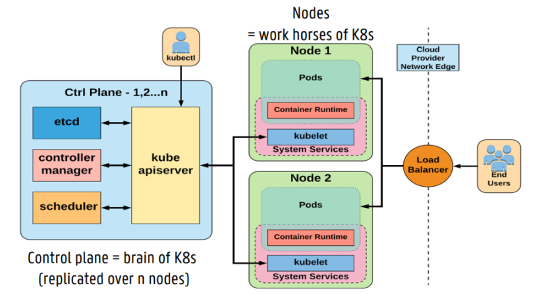
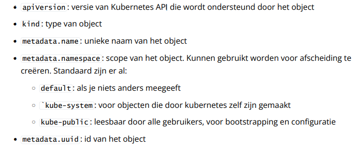
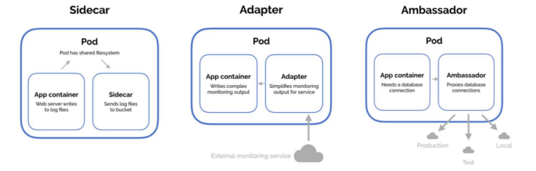
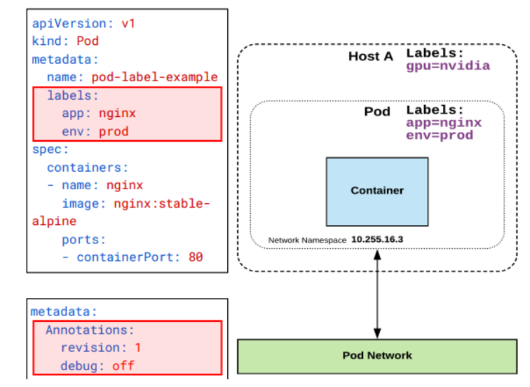
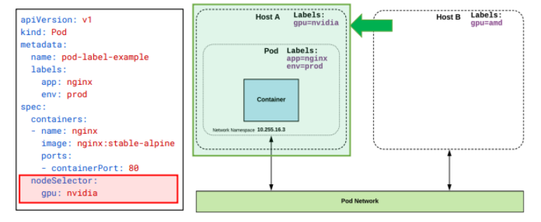
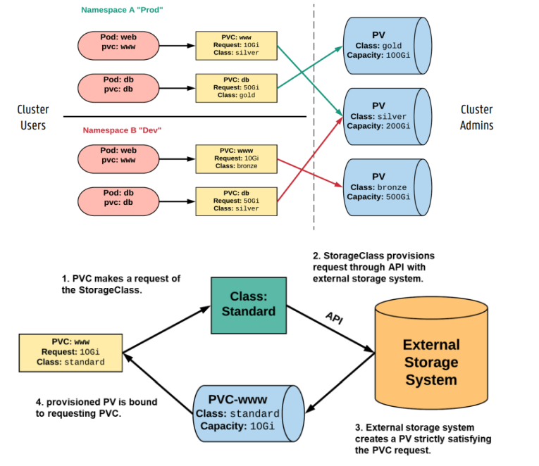
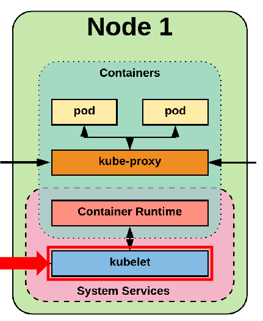
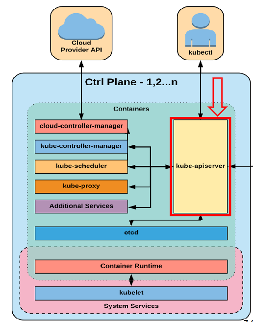
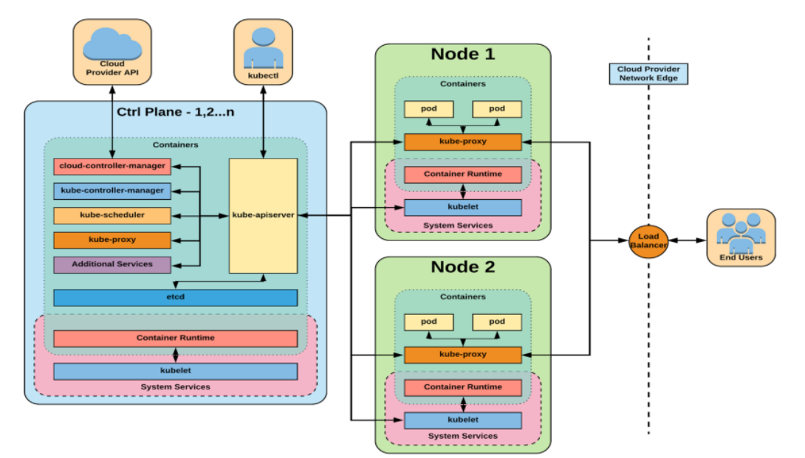
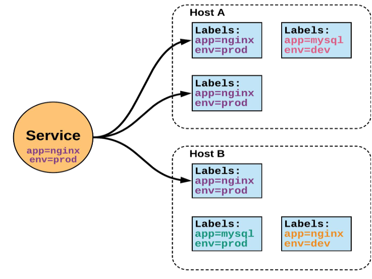

# Chapter 4: Kubernetes

We started with standard deployments, where software was installed directly on the OS of a server that was running. Then people began to use VMs. Now, many things are contained in a container.

The problem now is that you have to manage hundreds of containers. This is impossible to do manually. We are in need of a framework for container orchestration. This framework keeps busy with the deployment, scaling, and networking connections of containers. This is done in a declarative manner. That means you declare what the state of the system should be, not which steps are taken to get to that state.

Kubernetes was originally made by Google, but at a certain point, they became too big, and they needed another system. Luckily, Google did not dispose of it. Now it is widely used in production.

Kubernetes abstracts away the underlying hardware and provides a uniform interface that ensures that your workloads can use the resource pool. All services within Kubernetes are automatically load balanced, and can thus automatically scale up and down. Because of this, they are self-healing (the cluster will always move towards the desired state) and there is the possibility of seamless upgrading or rollback

Some features are:

- Automatic bin packing
  - Tries to set the jobs as efficiently as possible to have the best resources
- Autoscaling of workloads
- Blue/green deployments
  - Two production environments, one live (blue)
  - Load balancer switches between the two when there are problems or updates
- Jobs and cronjobs
  - Tasks and updates
- Management of stateless and stateful applications
  - Stateless: no context, no datastore (easily scalable)
  - Stateful: has state (harder to scale)
- Native methods for service discovery
  - Kubernetes always knows where what is located
- Easy integration with 3rd party applications
- Same API over bare metal and cloud
  - Is not the same with all Kubernetes distributions

## Architecture

- **end users**: users of application
- **nodes**: physical servers
  - 1 node can also be a VM, but it can brake easily
- **control plane**: brain of the whole thing

## Objecten

things in your cluster are presented as **kubernetes objects** in yaml files. All objects are required to have:

## Multi-container Pods

A pod is a collection of one or more containers with shared volumes, network, and namespace. These are part of a single context. Typically, you make a pod as small as possible. You can always address a pod with REST.

Pods are ephemeral, which means they can be turned off at any moment and that they don't have a fixed network address.

Usually, in Kubernetes, there is only one container per pod, but you can also have multiple. A pod is thus a wrapper around containers, and can therefore contain extra sidecar containers that implement supporting functions

- Sidecar

  - Typically provides supporting functions such as tracing, meshing, logging, or monitoring. For example, Prometheus.
  - You can have multiple sidecars

- Adapters

  - Can, for example, simplify the output of the monitoring. So, for example, only pull out the interesting things.

- Ambassador
  - Provides, for example, a connection with a database.
  - This is an expensive operation, so then the ambassador can, for example, maintain a pool of database connections from which you can take one.

## Labels, Annotations and Selectors

**Labels** ensure that everything is loosely coupled. They are key-value pairs that can be set by the user. You can hang a label on almost anything in your cluster (pod, host, node, ...). It is important to maintain uniformity as a sysadmin. You can also add **annotations**, which are extra metadata.

**selectors** use **labels** to filter objects and to select them. There are different selectors: _nodeSelector, ..._ These are usefull when you need to run your AI on a node with a GPU from nvidia. Then you set `gpu: nvidia`

## Storage

Kubernetes provides several different ways to handle data storage. There are four options:

- `Volume`

  - Tied to the lifecycle of a pod. If the pod is removed, the volume is gone. This is useful for things like cache.
  - Multiple different volumes can be attached to a pod.

- `PersistentVolumes`

  - Remains in existence, even if the pod is gone.
  - A pod cannot be directly connected to a `PersistentVolume`.
  - Different access modes such as: `ReadWriteOnce`, `ReadOnlyMany`, and `ReadWriteMany`. These specify how it may be used. `ReadWriteOnce` is, for example, useful for auditing.

- `PersistentVolumeClaims`

  - A request for a specific amount of space on a `PersistentVolume`.
  - This is important as the type of storage changes because without `PersistentVolumeClaims` there is no loose coupling.
  - Essentially similar to a pod, but instead takes storage resources in place of node resources.
  - These also have access modes.

- `StorageClasses`
  - Essentially a controller.
  - Ensures that sysadmins do not have to assign `PersistentVolumes` all the time.
  - A `StorageClass` provides a way to describe the storage available and underpins the automatic provisioning of `PersistentVolumes`.
  - `persistentVolumeClaims` are assigned automatically
  - complex to setup
  - see image below

## Nodes

A node consists of various parts:

- **Kubelet**

  - Responsible for the lifecycle management of the node
  - The brain
  - Manages only containers/pods created by Kubernetes

- **Kube-proxy**

  - Handles everything related to the node's network
  - Manages TCP, UDP, SCTP connections or load balancing for Kubernetes services
  - Ensures that pods can communicate with the outside world

- **Container runtime**
  - Can start, terminate, and manage containers
  - Various options available (containerd, CRI-O, Kata, Docker, ...)

## Control Plane

The control plane is the brain of Kubernetes and consists of several subcomponents:

- `kube-apiserver`

  - Single point of entry for the control plane
  - Provides a REST interface
  - Connects to `etcd`
  - Acts as a sort of gatekeeper for the cluster

- `etcd`

  - Key-value datastore for configuration information
  - Contains all YAMLs
  - It is fast and a distributed system
  - Can handle network partitions (when the network splits due to an error, leader election occurs)
  - Access is controlled in 4 steps:
    - Authentication: who you are
    - Authorization: what you may do
    - Admission control: may you do what you want to do
    - Persist: if the previous was successful, the action is saved if necessary

- `kube-controller-manager`

  - Tries all the time to get the cluster to the desired state
  - Manages control loops to do this
  - Keeps the state of the cluster in the data via the API server
  - Manages several controllers that each are responsible for a specific aspect of the cluster:
    - Node controller: looks after whether a server is down or comes up
    - Replication controller: ensures there are the correct number of pod replicas
    - Service account and token controllers: create default accounts and API access tokens

- `kube-scheduler`

  - Assigns pods to nodes
  - Decides which nodes will execute which pods
  - Defaults to bin-packing
  - You can set requirements
    - Hardware requirements
    - Affinity/anti-affinity: prefers to be together with a certain service or not
    - Labels

- `cloud-controller-manager`
  - A component that translates the Kubernetes API into the API calls of a cloud vendor
  - The vendors all have an implementation
  - Has a number of controllers:
    - Node controller: creates nodes
    - Route controller: configures network
    - Service controller: starts load balancer, assigns IP addresses, ...

**FULL OVERVIEW**

## Workloads

A **workload** is a high-level object and can represent an application of service running on cluster. **pod template**, allows kubernetes to create pods for a workload. There are different workloads:

- **Replicaset**
  - Common way to manage pod replicas and their life-cycle
  - Make sure the wanted amount of pods are spinning
- **Deployment**

  - Offers functionality for updates and rollbacks
  - Is an extension of `ReplicaSet`
  - Used for stateless applications
  - There are two strategies:
    - **Recreate:** all old pods are killed before new ones are created
    - **Rolling update:** the pods are updated selectively
      - Then you can update without downtime because the load balancer diverts the traffic away from the pods being updated
      - With `maxSurge`, new replicas can be added during an update
      - If there is a problem, you can rollback

- With a load balancer, there are also other deployment operations you can do

  - **Canary release:** make a small part of the application a new version to test. This only affects a small part of the users potentially exposing bugs
  - **A/B testing:** release two versions, users are randomly given one of the two. Then you can see which version works best

- **DaemonSet**

  - Ensures that each node that meets a certain criterion runs an instance of a certain pod
  - For example, for monitoring or log forwarding
  - Also has update strategies

- **StatefulSet**

  - Similar to a deployment, but is stateful
  - Maintains a unique identity for each pod and retains this when the pod is restarted

- **Job and CronJob**
  - **Job:** a certain task or script that needs to be executed, typically for a specific job
  - **CronJob:** a job that needs to be executed regularly according to a schedule

## Services

A service provides network access to a set of pods and thus acts as the entry point. The service is also a kind of load balancer and assigns external IP addresses to internal instances or services, directing traffic to where necessary. The primary service types are:

- **ClusterIP**

  - A service that keeps the internal pods behind it exposed on an internal virtual IP
  - For example, a helper microservice

- **NodePort**

  - An extension of ClusterIP
  - Opens a port on the IP of each node
    - Accessible from outside the cluster
    - You must know the IP and port (IP is usually not static)
  - Gives users access to the service
  - Sysadmin also has to open the firewall

- **LoadBalancer**

  - The standard way to expose services to the outside in cloud environments
  - Provides a unique, publicly accessible IP address that directs all connections to a specific service within
  - Each service in the cluster can have a LoadBalancer instance (can be expensive)

- **Ingress**
  - Essentially a service of a different type but acts as a controller that sets a set of rules
  - Acts as an entry proxy
  - Useful if you want to expose multiple services under the same address
  - More complex to maintain

## Helm, operators

Helm is a command-line package manager for Kubernetes that deals with software updates and installs of dependencies. These are day 1 tasks.

Operators are involved with day 2 management tasks such as monitoring or backups. They check if everything is running smoothly.

## Configuration

- **ConfigMap**

  - Non-confidential data in key-value pairs
  - Can, for example, be injected as environment variables

- **Secrets**
  - For confidential data
  - You need to turn on a setting to encrypt them; otherwise, they are just base64 encoded

## CNCFs open cluster management

- Focussing on multi-cluster and multi-cloud k8s - Creation of APIs for cluster registration, work distribution, dynamic placement of policies and workloads, etc.
  ̶
- In OCM a multi-cluster control plane is modelled by means of two distinct concepts

  - **Hub cluster**: nodes that run the multi-cluster control plane of OCM. Currently only an OpenShift hub is
    supported.
  - Klusterlet: the clusters being managed by the hub cluster, also called managed cluster or spoke cluster
    - Pulls the latest prescriptions from the hub cluster and consistently reconciles the physical k8s cluster to the expected state

- Currently no clearcut / winning solutions for federating a number of separate k8s clusters
  - **KubeFed** and **OCM** can both become important, but are still evolving and are not production-ready

Some examples of products focusing on multi-cluster solutions:

- VMWare Tanzu
- Google Anthos
- Red Had OpenShift
