# Chapter 5: Infrastructure as code

**Transcription of Merlijn talking about whats IMPORTANT**

> Van de verschillende applicaties die ik aangehaald heb, moet je de basis kennen. eum
> Bijvoorbeeld. Hoe werkt die applicatie? Hoe werkt Ansible? Waarom is dat al dan niet
> declaratief? eum Waarvoor kan het gebruikt worden, bijvoorbeeld op het schema, waar op
> dat schema is het gepositioneerd. Maar je moet bijvoorbeeld niet kunnen uitleggen hoedat
> die code er specifiek uitziet ofzo. eum Van de zaken gelijk de design patterns en de
> infrastructure as code zelf. Dat moet wel volledig gekend zijn. (10 seconden stilte) Oké als er
> geen verdere vragen zijn dan zal ik jullie laten. - Merlijn

## Levels of automation

The purpose of Infrastructure as Code (IaC) is the full management of the system environment by means of code. The idea being that all layers of the provision of a service are controlled and configured via software and set in code. This way we can use the tools we use to develop software to manage the system or infrastructure.

Through history, automation of system management has had different phases:

- **Manual**:

  - There are a number of problems with manual system management.
  - **Configuration drift**: Servers of the same service integrated can have updates and small changes that are unique to each server, which makes them differ. As a result, there can be a variation in performance, or even worse, not perform.
  - **Scaling**: As all servers need to be installed manually, this of course takes time and therefore costs.
  - **Unexpected problems**: What if the datacenter is on fire? If you're not working with IaC you have to manually begin setting up the datacenter again.

- **Scripting**:

  - We use batch files or powershell scripts to automate tasks. Of course, there are also problems if too much depends on scripting.
  - **Automation fear cycle**: You have scripts that can automatically regulate certain rules in the system. At a certain moment, you have to manually intervene when something goes wrong or a change is made in the configuration of the system. Now you do not know if the automation script will work anymore. So in the end, you're not daring to touch it anymore and you leave the manual configuration.
  - **Knowledge**: There is quite a bit of knowledge present in IT. Specific scripts can differ for each developer or they want to work in their own way. Every time you have to train people on new scripts, which costs time and therefore money.
  - **Maintenance**: The longer the same software is being used, the bigger the outdated, and the code that needs to be maintained. You have to constantly update the old scripts so the application does not crash because a certain code is not maintained.

- **Code Describing Infrastructure**:
  - A desired state manager describes what the desired state of the infrastructure is. This is given by an architect through management software, where the entire stack of infrastructure is described. The big advantage of this is that the entire stack is described.
  - The goal of IaC is to increase the consistency and reliability of the system by avoiding human errors and environment drift.

Improvement by avoiding human errors and environment drift.

- Due to IaC, the infrastructure actually documents itself.
- It encompasses the following things:

  - Scalability
  - Deployment and changes
  - Disaster recovery
  - Reusability
  - Workflow automation

- **Operators and Abstractions**:
  - See operators and abstractions at the end of this chapter.
  - This is more for the future.

Small sidenote from Merlijn. There is a difference between fault tolerance and disaster recovery:

- Fault tolerance:

  - We often need instances of one service twice, thus duplication and backups
  - If we have a minor issue on one service instance and can move to another instance
  - If one server crashes, we need to quickly switch to the other server without loss

- Disaster recovery worst-case scenario. What if everything goes to the cliffside? What if the building catches fire? We need to be able to switch to a different location as quickly as possible, where we can restore as much as we can.

## History

The first version of what is now CFEngine, developed almost thirty years ago by Mark Burgess, was groundbreaking in terms of configuring servers. The idea was for a declarative description of the desired state to generate a system configuration, rather than an imperative script telling the system how to achieve that state. This way, it doesn't matter what state is reached before the software works. Mark thought this was a better approach. Where you are now, you'll be eventually in the image.

## Terminology

IaC blurs the scripting in the following picture. Scripting is knowing where you are headed requires you to convert infrastructure not always converging on the desired state.

The big difference between the words imperative and declarative: If we explain someone how a room should look sorted with imperative programming, we step by step tell the program what it must do. When we work declaratively, we describe what the program should do. In detail, we tell it to sort. How it happens, when it occurs is not our concern. Therefore, the computer can decide itself on tasks and parallelization.

Merlijn provides a nice overview of the important terms in the chapter; thus, I quote him on:

- **IaC**: infrastructure, software, configuration, processes
- **Desired state**: what the user wants the data to be
- **Desired state principle**: end goal description
- **Model of Manifest**: configuration-based data of the desired state describes
- **Declarative**: describes the result
- **Imperative**: describes actions

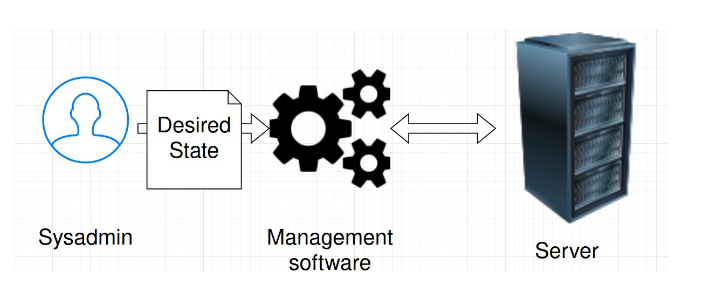

A configuration management system or orchestrator receives the desired state and goes on to implement the service configuration. If a configuration management system works based on idempotency, which means that repeatedly executing a task yields the same result every time, it ensures that any tasks performed on the system keep it in the desired state. Thus, the configuration management system makes sure that the system remains in the correct state after all tasks have been executed.

A configuration management system based on convergence will first check which actions need to be performed, and then carry out the necessary actions. If the system is already in the right state, no actions are performed. If you are already on the right track, you will find that this solution is faster.

It is also handy to know that Linux itself is not declarative. All tools create an imperative interface for Linux commands.

## Config management tools

### Ansible

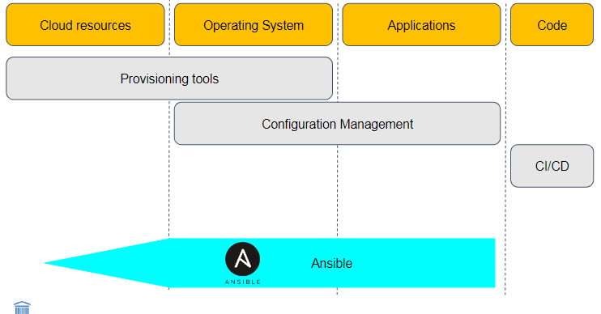

Ansible is a tool for configuration management that focuses on managing and installing server configurations, software, and services. Originally, Ansible was imperative: A playbook is a YAML file consisting of commands in the order they should be executed. But the real power of modern playbooks is their declarative nature, where you describe the desired configuration via the modules in the book. The Else mode is a Python script that is executed on the servers.

Here is an overview of the key components of Ansible:

- **Playbooks**

  - A YAML file describing tasks to be performed. These are executed sequentially.
  - Although Ansible is cross-platform, the playbooks you write are often platform-specific.
  - They are idempotent, meaning you can run a playbook multiple times on the same machine to achieve the same state without unintended consequences.
  - They are divided into plays.

- **Task**

  - The execution of an individual module.

- **Role**
  - A collection of templates and generated content.
  - Dynamically reusable, you can, for example, download from the internet and adjust to your use-case.

## Terraform

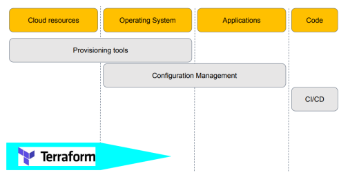

Terraform is primarily used for infrastructure. It focuses on setting up servers, virtual networks, gateways, ... Terraform is a fully declarative tool. That does not mean that the sequence in which various resources in the code are described matters. All the dependencies between servers must be explicitly stated.

Terraform is cross-platform and cross-cloud, but if you create a model for Amazon, you naturally can't use it for Azure. Below is an overview of the most important components of Terraform:

- **Configuration**
  - A file containing the description of multiple resources. An example of a resource is a server.
    - Here you describe your infrastructure: "I want this server from this provider."
  - To prevent the things you describe from being interpreted as Terraform code by accident
- **Providers**
  - Plugins used by Terraform to manage resources.
- **Modules**
  - These are reusable Terraform configurations.
    - For example, there is a module to set up Kubernetes.
- **Registry**
  - Online repository where all modules are available.

If Terraform is used on existing infrastructure, it is possible to create a plan to change the services you have. Then you can adapt these to your needs with Terraform. Terraform is often used in combination with Ansible, for example. Terraform is used to set up the servers and network, while Ansible is used to adjust the configuration of them.

## Chef

Chef is a versatile tool for documentation search because Chef uses terms like _cookbook_ and _knife_ for different concepts, which are extensively used. Among others, it is used by Facebook. Chef is inherently imperative. You write the desired state in Ruby code, which can also allow you to write a script that doesn’t work well if not thought out properly. You can use Chef to adjust servers using resources with a declarative configuration. These use the desired state principle, so you must make sure that all the resources are used and not just start writing Ruby to configure your infrastructure.

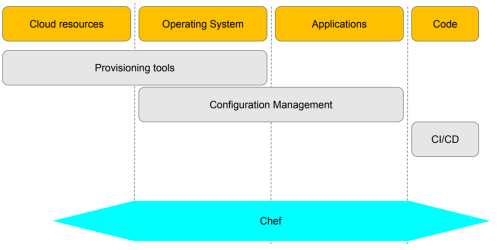

Chef is also cross-platform in the same way the previous two tools are cross-platform. The tool has meanwhile been so extensively expanded that you can do almost anything with it.

The most important components of Chef are:

- **Cookbook**

  - Contains multiple recipes.
  - Is a templated model of a desired state that you can use to set up various infrastructures.

- **Recipe**

  - Contains multiple resources.

- **Resource**

  - Describes the desired state.

- **Chef Supermarket**
  - Contains code from the community.

## Puppet

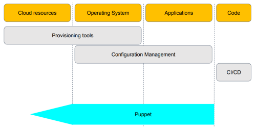

Puppet is similar to Ansible in that you can configure things with it, but you can also make cloud resources. Puppet is fully declarative, which means that the order of task execution is not fixed. You must, just like with Terraform, explicitly state dependencies. Puppet works through an agent on each server. These all collect their desired state from a master.

Puppet is very good for cross-platform use; you have to make a minimal number of changes to switch platforms.

## Juju

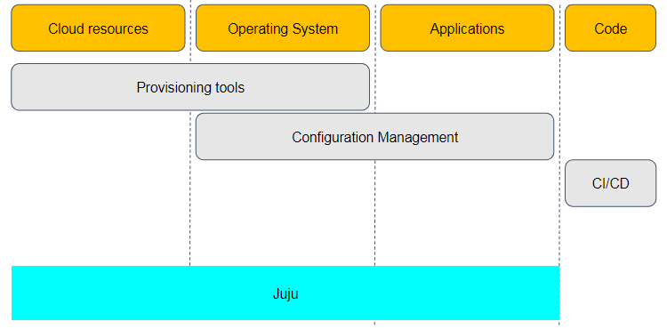

Strange as it may seem, Juju is one of the few tools that allows managing everything from cloud resources to applications. Juju is fully declarative, facilitated by a YAML model which you use to describe the desired state. Various agents retrieve the desired state from a controller. You manage the infrastructure by creating a model for use, where you describe which charms are to be utilized. Charms streamline a service tool such as Kubernetes or OpenStack. Juju is complex because applications may consist of many different components that depend on one another more than clear hierarchies allow.

In theory, Juju is cross-platform, but in practice, it is particularly well-optimized for Ubuntu.

Juju differs from other tools in terms of how it handles relationships. The way a charm in Juju is configured depends on which other Charms it is connected to. If a new Charm is introduced, the connected Charms are dynamically reconfigured. There's no need to adjust all other Charms when adding something new.

You can download charms or implement them in any programming language.

The greatest challenge with Juju is that you often need to get involved at the charm writing level. For instance, with tools like Puppet or Ansible, you might have to do a lot of work yourself. Juju is much more high-level. While Juju has a steep learning curve, as you delve deeper into its use, many tasks become much easier.

## Desired state configuration (DSC)

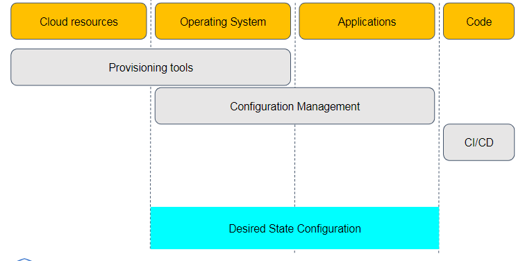

This is a tool from Microsoft that makes use of PowerShell and is declarative through the use of PowerShell objects. It consists of the following components:

- **Agent** (Local configuration manager)
  - **Configuration**
    - Contains at least one resource and one node
- **Resource**
  - Declarative description of the desired state
- **Node**
  - The external host where the desired state must be applied

DSC works a bit differently. You first write an imperative script, which is then converted into a declarative model. This results in a `.mof` file. This file deploys on a Windows server node with Push, or you configure a Pull server where the nodes periodically fetch their `.mof` files and DSC resources.

## Kubernetes

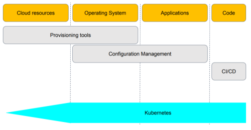

Kubernetes can be used for everything. It operates according to the desired state principle and is actually much more than a container orchestrator. For example, you can also use Kubernetes to set up a new Kubernetes cluster.

The best feature of Kubernetes is that it provides a standardized API for system administrators to integrate with the code that manages the infrastructure and applications. Moreover, this API can also be used to integrate other infrastructure code with the infrastructure.

By default, Kubernetes includes a number of APIs:

- Ingress controller (Citrix ADC)
- Overlay network (Calico)
- ClusterAPI (VMware vSphere)
- Cloud controller manager (Amazon AWS)
- Cloud service integration

## Operations and Abstractions

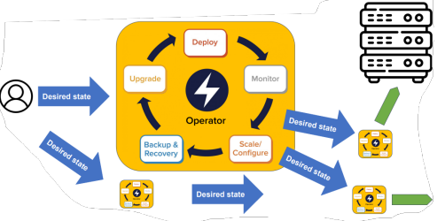

This is the final step in automation. The things mentioned here are the things we aim for in the future.

In software development, we make extensive use of abstractions. We employ layer upon layer of various software that creates abstraction above the underlying layers, allowing us, as programmers, to only concern ourselves with the layer we are working on.

We can also do this in system management through the use of an operator. When we want to set up certain things, we tell the operator what we want, and it calls the underlying modules on its own without us having to understand them. An operator does much more than a single deployment and works in a much more dynamic way than classic configuration management tools. The operator not only deals with deployment but also with upgrading, monitoring, scaling, and backing up your infrastructure. You also communicate with the operator via a desired state, and the operator will apply this in a very dynamic way.

## IaC Design Patterns

So, we know we have a fear cycle yes? How to stop this, well, its to continuously run the code!

=> **Unattended Automation**

Benefits include:

- discover issues quickly
- force yourself to fix these
- force yourself to improve
- out of band changes zijn niet aan te raden (manuele ingrepen!)

=> **Re-use and promote definitions**

Reuse the same definitions files accross environments for a given application or service. Makes sure you simply reuse stuff, and 100% know that shit works as in the other instance.

=> **Cattle, not pets**

See your services as shitdogs instead of cutie pies.
If a server crashes, nobody cares! just replace it.

Pets moet je manueel opstarten, ze zijn uniek en hun data staat nergens anders, make sure this does not happen!

Cattle means we have many servers, automated, duplicates everywhere, our infrastructure code fixes everything!

---

Another issue is that there is a lot of duplication between serveral teams.
(similar systems e.g. Database clusters)

How to fix this:

1.  Reuse by Forking Definitions (literatly fork the database for example)

Advantage:

- avoid tight coupling
- handles diverse requirements

disadvantages:

- divergence and inconsistencies

2. Reuse with definition libraries

has some isseus:

- tight coupling, so teams are not scared to change things because they dont want to block others
- Ownership of code shared by multiple teams

Guidance:

- use seperate pipelines
- Use CDC and other dependency testing strategies

For this you need a library pipeline:
first you test the definitions before pulling them into dependent pipelines.

so:

build -> test --> build -> test

so het gaat over gedeelde code om independant infrastructures op te zetten

Nu willen we zien hoe het werkt voor gedeelde code te gebruiken om gedeelde infrastructures op te zetten!

**Shared Elements**

The issue is that it is difficult to give ownership to anyone when everyone needs ownership of something (for example a loadbalancer...)

How to fix?

1. Avoid monoliths, optimize to simplify making changes!

## Declarative Linux

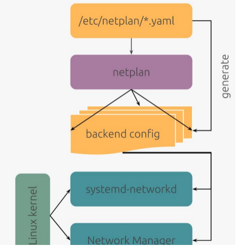

Most Linux distributions now, for instance, already work with a declarative configuration of the network (netplan, systemd-networkd). After this, Merlijn gave a whole bunch of examples, but I don't think I'm going to go into that much detail.

It boils down to the fact that netplan is a high-level declarative language with which you describe how you want your network to look. This is then converted into a backend network configuration for systemd-networkd for servers or for example Network Manager for Desktop Ubuntu users.

An example of a declarative Linux distribution is NixOS, which is often seen as just a package manager, but it is more than that. You can actually set almost everything declaratively. Here is a picture of NixOS.

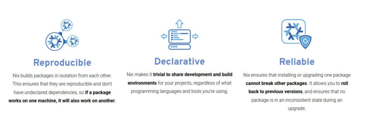
