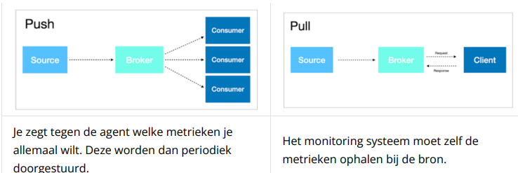
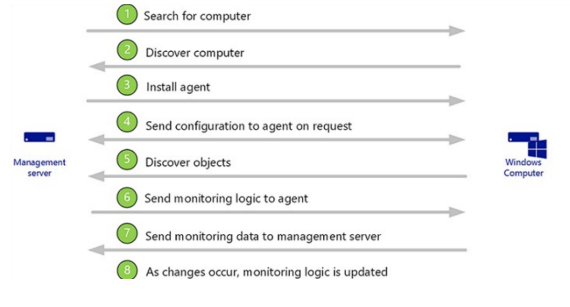
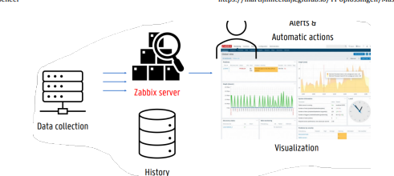
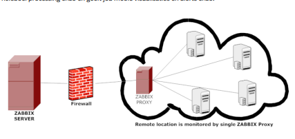
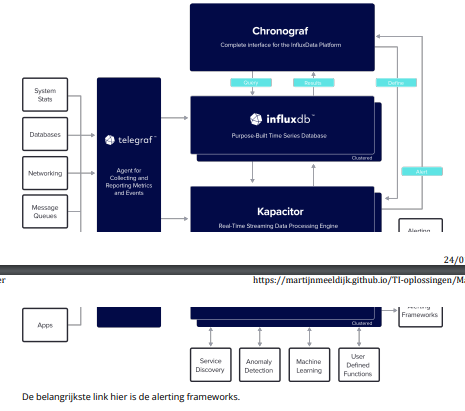
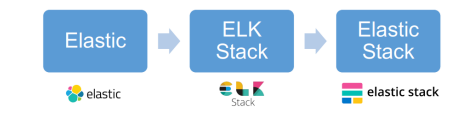
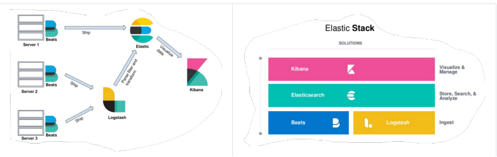
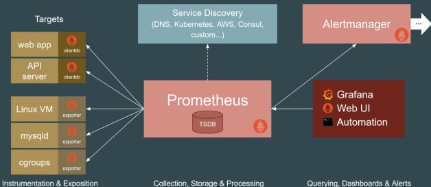
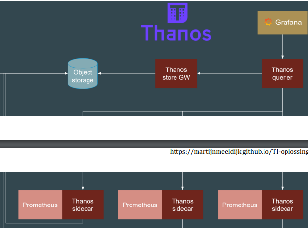
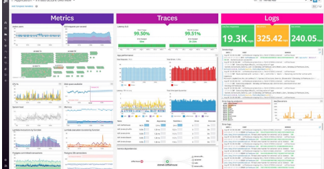

# Chapter 6: Monitoring

> Only last part about "Dynamo" is not to be known.

A **monitor** is a program or piece of hardware to gatekeep certain systems/resources

A huge problem with monitoring is that there are different kinds of formats, no consistent one, to which analysis becomes difficult. So use a **monitoring solution** instead.

## Principles

- **Monitoring**

  - Collect, process, aggregate and visualize real-time data about a system

- **White-box-monitoring**

  - Monitoring based on whats internal in the system (http handler, jvm profiling interface, logs)

- **Black-box monitoring**
  - Looking from the outside
  - Just how a user would see it

You will experience a lot of the symptoms with monitoring: for example, getting a 500 because the db connection is dead. Important is to seperate **what** from **why**

1. Collect useful and correct data, we make a seperation on 3 metrics:

- **Work Metrics**: - how many times do I get a http 200? - talks about the effort outputed by the system -

**Resource metric**: - how much RAM, CPU? - tells you about the usage of the program - helps with saving money -

**Events**: - Changes in code, alerts and scaling events

You can build a monitoring system using two methods: **push** and **pull**

Google tells us we have to follow **4 golden signals**:

- Latency
  - How long does it take to answer a request
  - It is important to seperate the successfull and failed requests
- Traffic
  - How much request is there for the application
- Errors
  - The amount of failed requests
- Saturation
  - How full is the service
  - Can the service handle more?

Detecting problems is more difficult than it seems. You can't just set a threshold for the use of a certain resource, because then you'll receive too many false-positive alerts. You could set the threshold to a very high level, but then you might miss actual issues. Moreover, it's also difficult to determine when a problem is really a problem. For example, setting an alert for when you get an error if your system exceeds a certain threshold for a certain period of time.

There must also be various thresholds for a problem and recovery. If, for instance, you get an error when the disk is at 99%, the problem is not solved if the disk drops to 98%, because then you might get an error again five minutes later.

To detect an anomaly, we need to set a norm based on past data and compare new data against this norm. You can even take it a step further. By predicting a trend, you can solve problems before they occur.

When a problem arises, there are various ways to respond. The software can solve it automatically, you can take a look yourself or open a ticket. Each step costs extra time and results in additional costs. We must strive for automatic problem resolution. We can, for example, send automatic alerts to people who can solve the problem. Finding a good balance here is important. If too many messages are sent, no one will pay attention anymore. Too few is naturally not good either.

In an application, one error can cause a whole cascade of different things to fail, causing all the lights in monitoring to start blinking. The intention here is that a module takes care of de-duplicating the errors. Then you can find the root cause and restore it.

## Microsoft Scom (Microsoft System Center Operations Manager)

Is a closed source monitoring solution from Microsoft. SCOM makes it easy to monitor multiple resources and devices.

**OM** can do the following:

- Tell you which objects are failing
- Send alerts
- Provide information
- You can choose as admin what needs to be monitored

## Infrastructure

OM consists of the following components:

- **Management server**

  - From here you manage everything
  - Has different roles:
    - Administer the configuration of the management group
    - Drive and communicate with agents
    - Communicate with databases in the management group

- **Operational database**

  - Configuration data is stored here

- **Data warehouse database**

  - All monitoring and alerting data is stored here

- **Management group**

  - A group of at least one management server, operational database, and data warehouse database

- **Optional components**
  - **Reporting server**
    - Creates and presents reports from the data in the data warehouse database
  - **Webconsole**
    - Easy interface to view data
  - **Gateway**
    - Allows computers outside the Active Directory domain to bring in monitoring data
    - Is actually a specialized type of a management server

### Agents

On each computer, an agent must be configured. This collects data, generated alerts etc. The agents get their configuration from a management server in their management group where they also report information

Instead you can also use a **proxy agent**. Same thing but allows you to send data of another computer to the management server.

### Management Pack

A management pack is a packet that automatically installs all the necessary installs to monitor. In here, **rules** exist. They tell you what to keep for collection etc.

Objects are found and monitored in the following steps:

## Deployments

You can deploy OM in several ways:

- **Single-server**

  - Used for evaluation deployment and testing
  - All management group roles are combined on one server
  - All monitored devices must be in the same AD forest as the management group
  - Poor robustness and performance

- **Distributed deployment**
  - For example, multiple management servers in one resource pool
  - Scalability
  - Audit collection
  - 99% of OM deployments work this way
  - You can now even monitor things in the public cloud with your own monitoring system
  - You can host OM yourself in the cloud

The problem is that Microsoft actually can kill SCOM at any time. It's hardly used anymore. Now they use Azure Monitor.

## Zabbix

Zabbix is an enterprise open-source monitoring solution for networks and applications. The code is open-source, but more money is well spent on Zabbix for guarantees and installation etc. Some key features include:

- Good performance and capacity
- Autodiscovery
- Low-level discovery
- Flexible monitoring
- Agentless monitoring
- Extensive email notifications on pre-programmed events
- Secure user authentication

### Architecture

Send all data to the Zabbix Server. It gives you nice visualizations etc.

Zabbix can collect data on all layers (hardware, os, network, ...). This can be done in two ways:

- Pull
  - execute service check of script
  - Passive agent: only works when a request has been made
- Push
  - Device will log by itself
  - Active agent: Forwards data periodically

## Tick stack

The TICK stack is an open-source monitoring solution. TICK stands for:

- **Telegraf**

  - Data collection
  - Works with plugins and can work with external scripts
  - Minimal memory usage

- **InfluxDB**

  - Scalable time-series database for metrics, events, real-time analytics
  - SQL-like query language
  - Supports 'continuous queries'
  - InfluxDB v2 contains Chronograf and Kapacitor

- **Chronograf**

  - Data visualization, database management
  - Overview of the infrastructure
  - Alert management

- **Kapacitor**
  - Processing of both streaming and batch data
  - Can perform all transformations that InfluxQL can do
  - You can easily create pipelines

This roughly translates to:

## Elastic Stack

Elastic was originally just a search engine, but it has expanded into something much bigger: a well-integrated monitoring tool. This is where the formerly separate pieces have merged into the Elastic stack in three stages. First, there was the standalone Elastic search, then the ELK stack.

ELK stands for:

- **Elasticsearch**

  - Open-source RESTful search engine for analytics
  - JSON based

- **Logstash**

  - Data processing pipeline
  - Transforms and ships data
  - Pushes data into Elasticsearch, but can also push to other destinations

- **Kibana**
  - Visualization and UI
  - Dashboards

A problem with the ELK stack was that data shippers (the edge data routers) often had very heavy workloads requiring some specific functionality. This led to the introduction of Beats. These are small plging that send the data. There are several, including Filebeat for data logging, Metricbeat for metrics, Packetbeat for network data, etc. With the introduction of Beats, we entered the last phase. The Elastic stack.

## Prometheus

Prometheus is a metric-based monitoring and alerting stack thats made for dynamic cloud-envs. Prometheus is only the time-series database.

You can write queries using promQL, this is a new query language different from SQL. Easier to do calculations, Prometheus saves the data locally, without clustering, so on 1 spot. For short periods this is ok, but for longer periods, you write the data to a decoupled remote storage.

You can upgrade the scalability with Thanos!

### Service discovery

The advantage of prometheus is service discovery. This means that itcan find services and start monitoring.

## Standardized APIs and formats for monitoring

When we want to switch from Zabbix to the Elastic stack, we are stuck. The solution to this problem is not to monitor more but to observe. This is actually a subset of monitoring, focusing on observing and collecting three types of data to ensure the performance and health of a system:

- **Metrics**: Quantifiable pieces of data

  - What is my load, CPU, memory, etc.

- **Traces**: What happened and in what order

  - What is the flow of my request?

- **Logs/events**: Specific occurrences

  - What is an error? What isn't an error?

If we have standardised APIs to collect certain metrics etc, we can make better preventions/predictions in the future.

Some other open-source examples are:

## Opentracing

- Knows what was performed and which path it took
- A standardized API for tracing, provides a specification for developers to supply their services with distributed tracing.
  - Currently archived

## Opencensus

- Comes from Google
- A collection of libraries to gather metrics and to export data
- Can send to different back-ends
  - Also archived

## Opentelemetry

- Opentracing + Opencensus

## Openmetrics

- Influenced by Prometheus
- A format that specifies how metrics should look (standardization)
  - e.g. `component1.metric`
- Can be used in conjunction with Opentelemetry

## Which one should I choose

- **Microsoft SCOM**

  - If you have a Microsoft environment

- **ELK Stack**

  - Primarily for logs

- **TICK, Prometheus, Zabbix**
  - Especially good for things with containers
  - Zabbix is user-friendly and can handle larger topologies
