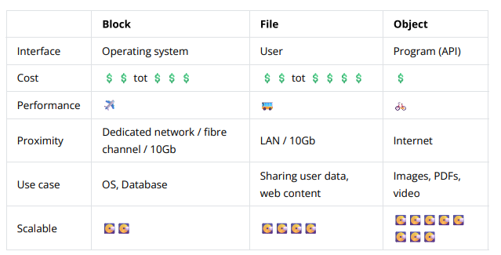
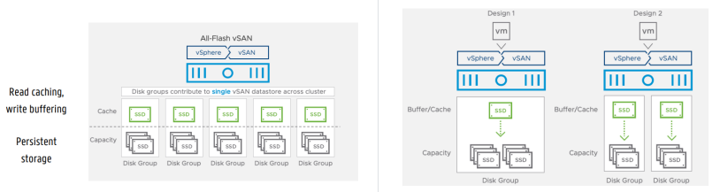

# Chapter 7: Storage Virtualization

## Intro

With storage virtualization, we hide the underlying complexity of physical storage media, providing a logical overview of these media for computer systems. In general, hiding, abstracting, or isolating the internal functions of the system. This offers network- and application-independent management of storage or data.

Storage virtualization has several advantages:

- **Simplified Management**

  - Developers do not need to worry about storage
  - No need to know where the data is stored

- **Avoids Underutilization**

  - Improved performance
  - Less investment in hardware

- **Higher Flexibility**

  - Allows pay-per-use
  - Storage can be added or removed as needed

- **Scalability and Fault Tolerance**

  - Quick access to remote data, backup, mirroring, replication

- **Ability to Combine Storage from Multiple Vendors**

## Types

- **File-Level Virtualization**

  - Everything in virtual storage is presented as a file system
  - This is in the form of hierarchically structured files and folders
  - We can move physical boundaries, but they appear as a unified file system
  - Management of the file system is done by a virtualization entity

  **Advantages**

  - Retains hierarchical structure
  - Easy navigation
  - Existing applications typically use it, so the application does not need to be modified

  **Disadvantages**

  - Systems need to scale through adding extra file systems, not just by adding more capacity
  - Thus slightly less scalable

  **Examples**

  - Amazon Elastic Filesystem
  - Google Cloud Filestore

- **Block-Level Virtualization**

- Maps virtual blocks to the physical blocks of storage devices
- The OS or application does not need to create its own filesystem
- Storage capacity is presented in the form of virtual disks
- Typically used for high-performance applications

  **Advantages**

  - No longer a single path to the data
  - Direct access to various blocks, faster retrieval
  - Easy partitioning of blocks
  - Well scalable for large databases

  **Disadvantages**

  - Relatively expensive
  - Cannot deal with metadata (responsibility of the application)

  **Examples**

  - AWS Elastic Block Storage
  - Google Persistent Disks

**Object-Level Virtualization**

- For applications that work with various types of unstructured data
- The structure is not significant
- Data is stored in discrete units, each with its own metadata and unique ID
- Stored in a single flat repository
- Made available through an API via HTTP requests

  **Advantages**

  - Very scalable
  - Perfect for unstructured data, ideal for photos, videos, or social media
  - Good for static data
  - Quick retrieval through object storage metadata

  **Disadvantages**

  - Objects cannot be modified afterwards; they must be rewritten, thus lesser performance
  - Difficult match with traditional databases
  - Extra complexity in development due to object storage API

  **Examples**

  - WeTransfer
  - Messenger
  - Amazon S3
  - Google Cloud Storage

**Bespreek het verschil tussen block, file and object gebaseerde storage virtualizations**

## Methods

There are several methods by which storage virtualization can be implemented:

### Host-based Virtualization (ga je typisch niet meer gebruiken)

- A type of virtualization where the host provides storage to the guest OS.
- Virtual machines do not take the entire disk; instead, they manage a virtual drive, which is simply a file.
- Can be dynamically resized to be larger or smaller.
- Limited scalability
  - Limited to the host where the file is located.
- Overhead from maintenance and software
  - Runs on the OS of a host.
- Certainly not the best solution.

### Array-based Virtualization (ook ouder)

- Differentiates between various tiers of storage.
  - For example, between high-speed and standard tier (SSD, HDD).
- A logical unit can consist of both high-speed and standard tier disks.
- Then the high-speed media often serve as read-write cache, or data is first adjusted on the high-speed layer.
- Layered synchronization can be performed
  - How this is done is the responsibility of the virtualization entity.
- Generally increases performance.
- Not widely used yet, but is one of the most significant applications.

### Network- or Fabric-based Virtualization

- We can see a computer under which storage from various vendors hangs
  - NAS, SAN, and others.

## Network Storage

There are three types of network storage:

### Direct-attached Storage (DAS)

- Clients can connect with one or several servers on which various types of data are stored.
- Developed to scale storage capacity as data volumes grow by placing disk arrays on a server.
- The server security becomes a bottleneck as all storage devices constitute a single point of failure.
- A lot of bandwidth is used for access, storage, and backups of data.

### Network-attached Storage (NAS)

- Originates from DAS.
- One or more dedicated file servers are made available in a local network (LAN).
- The network is not seen as a bottleneck, especially for backups.

### Storage-area Network (SAN)

- A separate network with storage devices (storage area).
- Connected via a special SAN switch.
- Provides a pool of storage space.
- Each computer can access the storage on the SAN as if they were local disks.
- Uses the Fibre Channel protocol.

  **Components of SAN**

  - **Node**: Any end device connected to the SAN (typically servers).
  - **Fabric**: All the hardware that connects servers and storage devices via fibre channel switching
  - **Fibre Channel**: A high-speed network technology specifically designed for storage area networks.
  - **World-wide name (WWN)**: A unique identifier for each storage device.
  - All data transfers such as backups occur behind the servers and are transparent.
  - Consequently, it is generally more expensive than NAS.

  **Advantages**

  - Simultaneous access by multiple hosts.
  - Consolidation of storage.
  - Reduced ownership and management complexity.
  - Increased availability, scalability, and data protection.
  - More efficient use of capacity.

**protocols for SANS not to know!**

## Hyperconvergence

The concept of hyperconvergence is to create a framework that integrates storage, computing, and networking. All IT shit should work together as a single entity. Hyperconvergence uses virtualized computing (hypervisor), software-defined storage, and virtualized networking. More granular data center functions are drawn down onto an integrated software layer instead of specific hardware.

The virtualization software abstracts and allocates underlying resources dynamically for applications in VMs or containers. This approach has several advantages:

- **Reduces data-center complexity and enhances scalability.**
- **Improves resource efficiency.**
- **Reduces time and cost savings.**
- **Reduces dependency on software** (e.g., disaster recovery tools); although solutions like VMware are comprehensive, they can be expensive.

## Technologies

### VMware vSAN

VMware vSAN provides distributed, shared data storage. It aggregates DAS storage devices into a single storage repository, which is then virtually linked within a vSphere cluster. This eliminates a single point-of-failure due to:

- Data replication
- Erasure codes\*

It also supports:

- Snapshots
- Storage cloning

vSAN also works with various tiers (like data tiering) for enhanced performance. In the second image, you have two options to implement this. Option 1 is cheaper but offers less reliability. Option 2 is more expensive, but like a SAN, it doesn't suddenly grant access to everything.

Furthermore, vSAN can be combined with Kubernetes. You can use vSAN for PersistentVolumes, thereby providing a virtual volume that is available for your pods.

## Erasure Codes

Erasure codes ensure that data is spread across multiple servers, thus even if some data gets lost, the complete data can still be reconstructed without a complete loss. Consider the following example:

We assign the numbers \( a = 49 \) and \( b = 75 \) in three servers. You can use a function like the one below to distribute values across different servers:

f(i) = a + (b - a) \* (i - 1)
f(1) = 49
f(2) = 75
f(3) = 101

You can always adjust the formula to fit the data needs and recompute when the server restarts, without needing a complete backup taken. This is actually an example meant to simplify understanding. You can also use XOR operations.

## CEPH

CEPH is an open-source distributed storage solution that includes object-, block-, and file-based storage types, mainly recognized for its scalable and distributed approach which avoids any single point-of-failure.

Key components used to facilitate this include:

- **Cluster monitors (mon)**

  - Keep track of the state of the various devices in the cluster
  - Monitor which devices are active or down

- **Object storage devices (osd)**

  - Store the actual data

- **Metadata server (mds)**

  - Keep track of where data is stored
  - Metadata for object-based storage

- **HTTP gateways (radosgw)**

  - Provide access to storage via an API
  - Often compatible with Amazon S3 and OpenStack Swift (for hybrid storage)

- **Managers (mgr)**
  - Oversee tasks like backups, monitoring, and other maintenance activities

## Rook

Rook acts as an interface between CEPH and Kubernetes, ensuring that our distributed storage system can work seamlessly with various pods. This allows our storage system, typically managed through separate systems, to be centrally managed from Kubernetes. Rook ensures that CEPH can operate with Kubernetes clusters. All configuration and storage management is thus automatically handled.

If additional storage is needed within Kubernetes, Rook will deploy agents and operators, such as:

- **Operator**

  - Ensures that different storage clusters are maintained properly
  - Also performs monitoring

- **Agent**
  - Runs on each storage host
  - Manages all storage operations (network storage tasks, volume mounting, etc.)

## MinIO

MinIO is also a storage solution and consists of several components:

- **MinIO Server**

  - Provides distributed object storage with an Amazon S3 API
  - Supports encryption, erasure coding, replication, etc.

- **MinIO Client**

  - Acts as a CLI that allows you to interact with MinIO servers to configure and manage them

- **MinIO SDKs**
  - APIs that enable other S3-compatible object storage to interact

Thus, MinIO can leverage an API from Amazon S3, Azure Blob and other private clouds. It can even be used together with vSAN in Kubernetes environments.

## Red Hat Gluster

- Fully open source.
- You can utilize Amazon S3 for object storage.
- Inherently fully container-based.
- Avoids single point-of-failure.

You can use various protocols to manage data and storage spaces. Different physical resources are offered as a whole. Here, hyperconvergence is also applied. Servers, disks, etc., are presented by the virtualization entity to the application.
